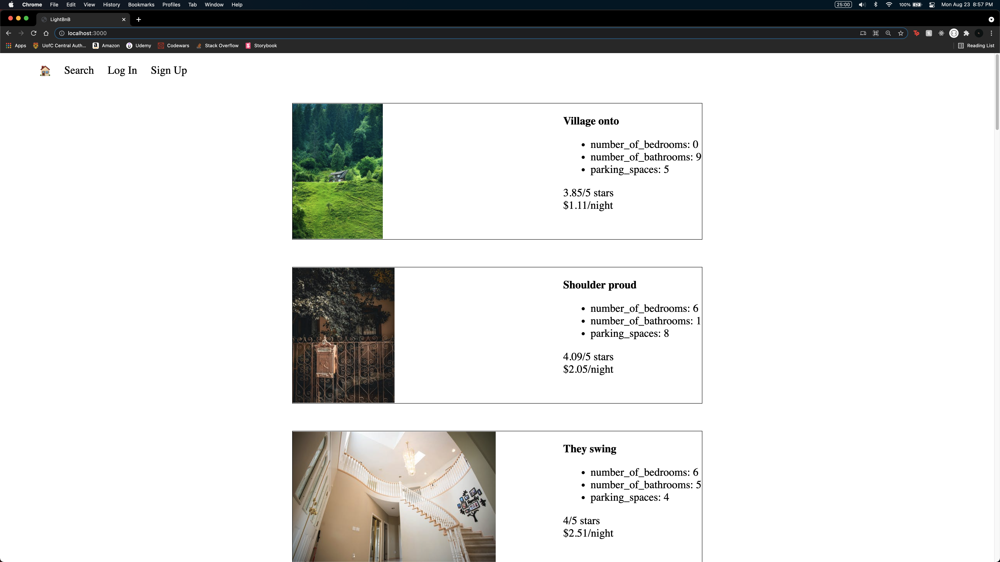
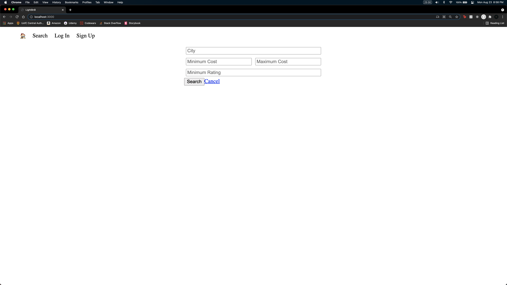

# LightBnB

This is an Airbnb clone

### Setup

Make sure all dependencies are install before running the app with `npm install`, then run `npm start` in the `LightBnB_WebApp-master` directory and navigate to `localhost:3000` on your browser.

### Dependencies

- bcrypt
- body-parser
- cookie-session
- express
- nodemon
- pg

### Final Product

